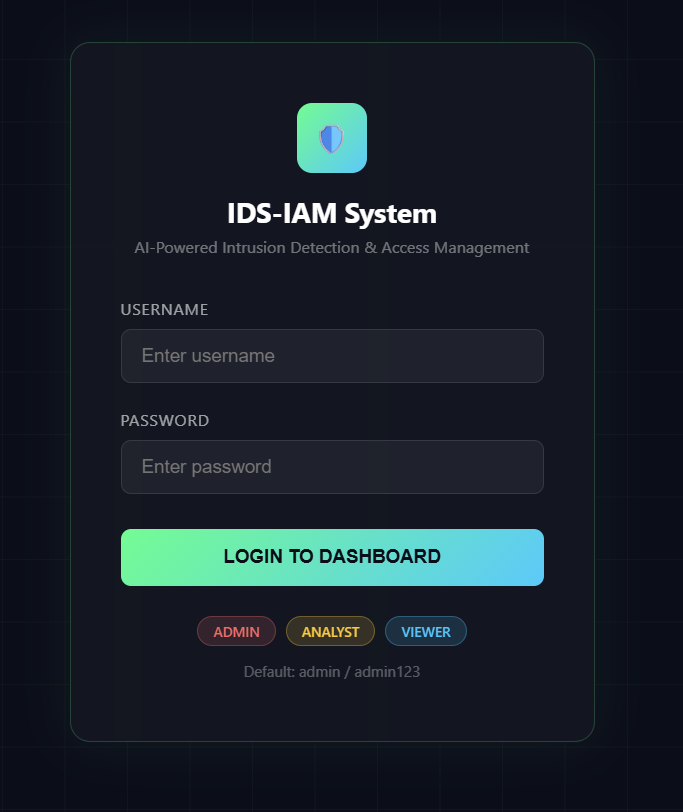
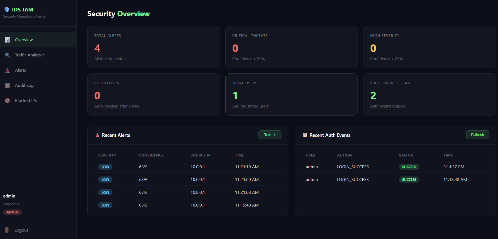
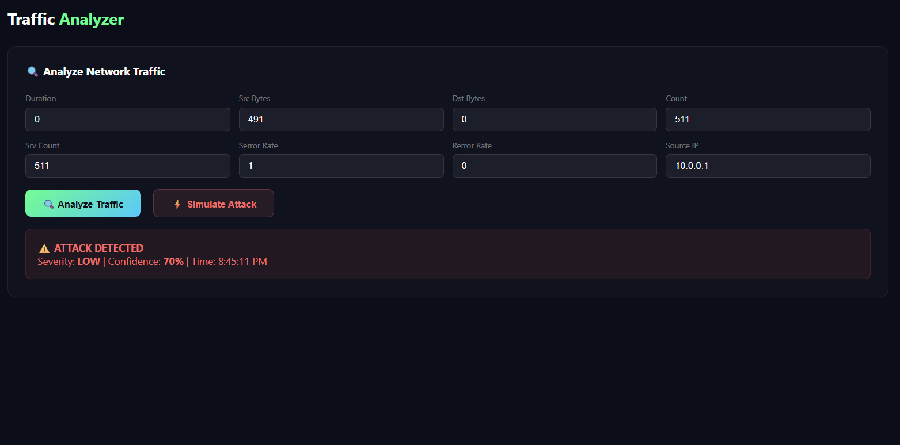
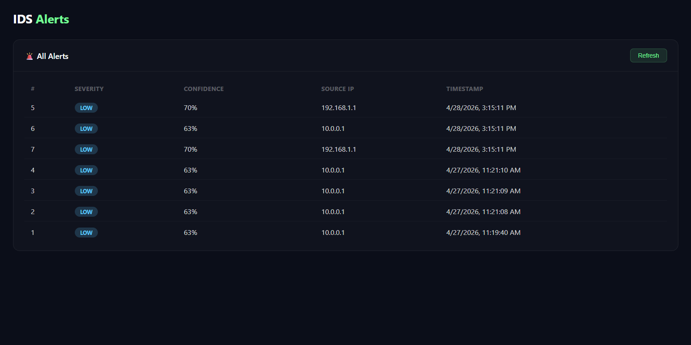
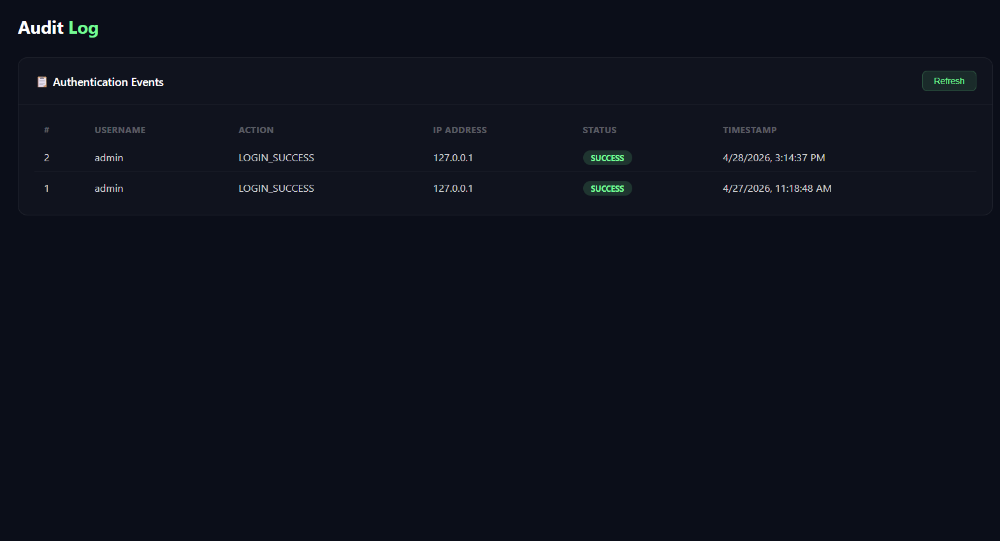

# 🛡️ AI-Powered Intrusion Detection System with IAM Integration


A production-grade security system combining **Identity & Access Management (IAM)** and **AI-powered Intrusion Detection (IDS)** into a unified Security Operations Center dashboard.

>  **Live Demo:** [https://ids-iam-security-system.onrender.com](https://ids-iam-security-system.onrender.com)  
>  **Default Login:** username: `admin` | password: `admin123`

---

## Screenshots

| Login Page | Overview Dashboard |
|---|---|
|  |  |

| Traffic Analyzer | Alerts | Audit Log |
|---|---|---|
|  |  |  |

---

##  System Architecture

```
┌─────────────────────────────────────────────────────────┐
│                    Client (Browser)                      │
└─────────────────────┬───────────────────────────────────┘
                      │ HTTP Requests
┌─────────────────────▼───────────────────────────────────┐
│                  Flask REST API                          │
│  ┌─────────────────────┐  ┌──────────────────────────┐  │
│  │     IAM Layer        │  │       IDS Layer           │  │
│  │                      │  │                           │  │
│  │ • JWT Authentication │  │ • Random Forest Model     │  │
│  │ • RBAC (3 roles)     │  │ • 99.97% Accuracy         │  │
│  │ • Brute Force Block  │  │ • Severity Scoring        │  │
│  │ • Audit Logging      │  │ • Real-time Inference     │  │
│  └──────────┬───────────┘  └────────────┬─────────────┘  │
│             │                           │                  │
│             └───────────┬───────────────┘                  │
│                         │ Integration Layer                 │
│              IAM events feed IDS signals                    │
│              IDS decisions enforce IAM policies             │
└─────────────────────────┬───────────────────────────────┘
                          │
┌─────────────────────────▼───────────────────────────────┐
│                  SQLite Database                          │
│  users │ audit_log │ alerts │ blocked_ips │ failed_attempts│
└─────────────────────────────────────────────────────────┘
```

---

##  Features

###  IAM — Identity & Access Management
- **JWT Authentication** — Stateless token-based auth with 8-hour expiry
- **Role-Based Access Control (RBAC)** — Three permission levels:
  - `Admin` — Full access: user management, unblock IPs, all dashboards
  - `Analyst` — Traffic analysis, alerts, audit log access
  - `Viewer` — Read-only dashboard access
- **Brute Force Prevention** — Auto-blocks IP after 5 failed login attempts in 10 minutes
- **Audit Trail** — Every authentication event logged with timestamp, IP, and status
- **bcrypt Password Hashing** — Passwords never stored in plain text

###  IDS — Intrusion Detection System
- **ML-Powered Detection** — Random Forest classifier trained on KDD Cup 1999 dataset
- **494,021 training records** — DoS, Probe, R2L, U2R attack categories
- **99.97% Classification Accuracy** on test data
- **4-Level Severity Scoring:**
  - `CRITICAL` — Confidence > 95%
  - `HIGH` — Confidence > 85%
  - `MEDIUM` — Confidence > 70%
  - `LOW` — Confidence < 70%
- **Real-time Inference API** — Analyze any network traffic features instantly

###  IAM + IDS Integration
- Failed login attempts automatically analyzed as potential brute force attacks
- IDS severity scores trigger IAM enforcement (IP blocking)
- Unified audit trail across both systems
- Single dashboard for complete security visibility

###  SOC Dashboard
- Real-time statistics — total alerts, critical threats, blocked IPs
- Live traffic analyzer with one-click attack simulation
- Complete alerts history with severity and confidence
- Full authentication audit log
- Blocked IP management with unblock capability
- Auto-refresh every 30 seconds

---

##  Tech Stack

| Layer | Technology |
|---|---|
| Backend | Python 3.12, Flask 3.1 |
| ML Model | Scikit-learn, Random Forest, Pandas |
| Authentication | Flask-JWT-Extended, bcrypt |
| Database | SQLite |
| Frontend | HTML5, CSS3, JavaScript, Chart.js |
| Deployment | Render.com, Gunicorn |
| Dataset | KDD Cup 1999 (NSL-KDD) |

---

##  Run Locally

### Prerequisites
- Python 3.10+
- Git

### Installation

```bash
# Clone the repository
git clone https://github.com/priya-kholiya/ids-iam-security-system.git
cd ids-iam-security-system

# Create virtual environment
python -m venv venv

# Activate (Windows)
venv\Scripts\activate.bat

# Activate (Mac/Linux)
source venv/bin/activate

# Install dependencies
pip install -r requirements.txt
```

### Dataset Setup
1. Download KDD Cup 1999 dataset from [Kaggle](https://www.kaggle.com/datasets/galaxyh/kdd-cup-1999-data)
2. Place `kddcup.data_10_percent_corrected` in `data/` folder
3. Rename to `network_traffic.csv`

### Train the Model
```bash
python model/ids_model.py
```
Expected output:
```
Dataset loaded: 494021 records
Normal: 97278 | Attack: 396743
Training Random Forest model...
Model Accuracy: 99.97%
Model saved to model/ids_model.pkl
```

### Run the Application
```bash
python app.py
```
Visit: `http://127.0.0.1:5000`

**Default credentials:**
```
Username: admin
Password: admin123
```

---

## 📡= API Endpoints

### Authentication (IAM)
| Method | Endpoint | Access | Description |
|---|---|---|---|
| POST | `/auth/login` | Public | Login and get JWT token |
| POST | `/auth/register` | Admin | Register new user |
| POST | `/auth/logout` | All | Logout |
| GET | `/auth/users` | Admin | List all users |
| GET | `/auth/audit-log` | Admin, Analyst | View audit trail |
| GET | `/auth/blocked-ips` | Admin, Analyst | View blocked IPs |
| POST | `/auth/unblock-ip` | Admin | Unblock an IP |

### Intrusion Detection (IDS)
| Method | Endpoint | Access | Description |
|---|---|---|---|
| POST | `/ids/analyze` | Admin, Analyst | Analyze network traffic |
| GET | `/ids/alerts` | Admin, Analyst | Get all IDS alerts |
| GET | `/ids/stats` | All | Dashboard statistics |

---

##  ML Model Performance

```
Dataset:     KDD Cup 1999 (10% subset)
Algorithm:   Random Forest (100 estimators)
Train/Test:  80% / 20% split
Accuracy:    99.97%

Classification:
              precision    recall  f1-score
normal           1.00       1.00      1.00
attack           1.00       1.00      1.00
```

---

##  Security Concepts Demonstrated

| Concept | Implementation |
|---|---|
| Authentication | JWT tokens with expiry |
| Authorization | Role-based access control |
| Account Lockout | 5 failed attempts → IP block |
| Audit Logging | All events with IP + timestamp |
| Password Security | bcrypt hashing (salt rounds) |
| Anomaly Detection | ML-based traffic classification |
| Threat Severity | Confidence-based scoring |
| Incident Response | Auto-block + alert dashboard |

---

##  Project Structure

```
ids-iam-security-system/
├── app.py                    # Main Flask application + IDS routes
├── auth/
│   └── auth.py               # IAM — authentication + RBAC
├── model/
│   └── ids_model.py          # ML model training + inference
├── templates/
│   ├── index.html            # Login page
│   └── dashboard.html        # SOC dashboard
├── data/                     # Dataset (not in repo)
├── requirements.txt          # Python dependencies
├── render.yaml               # Render deployment config
├── Procfile                  # Gunicorn start command
└── .gitignore
```

---

##  Deployment

Deployed on **Render.com** with automatic GitHub integration.

Every push to `main` branch triggers automatic redeployment.

---

##  Author

**Priya Kholiya**  
B.Tech CSE (Cybersecurity)   
[GitHub](https://github.com/priya-kholiya) · [LinkedIn](https://www.linkedin.com/in/priya-kholiya-861026256/)

---

##  License

MIT License — feel free to use this project for learning and reference.

---

*Built as part of Network Security coursework — demonstrating enterprise IAM and ML-based IDS concepts*